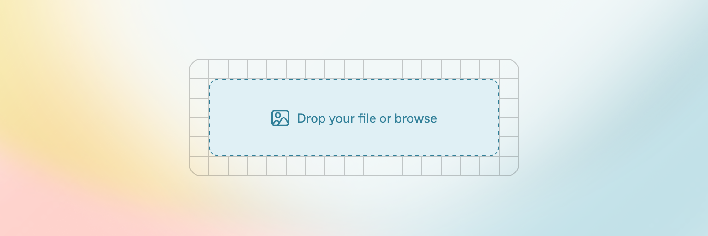

# Warna

## Warna Utama

<table data-card-size="large" data-view="cards"><thead><tr><th></th><th></th><th></th><th data-hidden data-card-cover data-type="image">Cover image</th></tr></thead><tbody><tr><td><strong>Primary</strong></td><td><kbd>#12345</kbd></td><td>R:878 G:767 B878</td><td><a href="../.gitbook/assets/Screenshot 2025-08-30 at 17.25.14.png">Screenshot 2025-08-30 at 17.25.14.png</a></td></tr><tr><td><strong>Secondary</strong></td><td>#123</td><td>R:878 G:767 B878</td><td><a href="../.gitbook/assets/Screenshot 2025-08-30 at 17.25.14.png">Screenshot 2025-08-30 at 17.25.14.png</a></td></tr><tr><td><strong>Accent</strong></td><td>#231421</td><td>R:878 G:767 B878</td><td><a href="../.gitbook/assets/https___gitbookio.github.io_onboarding-template-images_images-hero.webp">https___gitbookio.github.io_onboarding-template-images_images-hero.webp</a></td></tr><tr><td><strong>Base</strong></td><td>#231421</td><td>R:878 G:767 B878</td><td><a href="../.gitbook/assets/Screenshot 2025-08-30 at 17.25.14.png">Screenshot 2025-08-30 at 17.25.14.png</a></td></tr></tbody></table>

<table data-view="cards"><thead><tr><th></th><th></th><th data-hidden data-card-cover data-type="image">Cover image</th></tr></thead><tbody><tr><td><mark style="color:$primary;"><strong>Gradient Pri</strong></mark></td><td><ul><li>HEX: #345679</li><li>RGB<strong>:</strong> (0, 91, 172)</li><li>hsl<strong>:</strong> 208, 100%, 34%</li><li>css: gr-primary</li></ul></td><td><a href="../.gitbook/assets/https___gitbookio.github.io_onboarding-template-images_images-hero.webp">https___gitbookio.github.io_onboarding-template-images_images-hero.webp</a></td></tr><tr><td><strong>Gradient Secondary</strong></td><td><ul><li>HEX: #345679</li></ul><ul><li>RGB<strong>:</strong> (0, 91, 172)</li></ul><ul><li>hsl<strong>:</strong> 208, 100%, 34%</li></ul><ul><li>css: gr-secondary</li></ul></td><td><a href="../.gitbook/assets/https___gitbookio.github.io_onboarding-template-images_images-hero.webp">https___gitbookio.github.io_onboarding-template-images_images-hero.webp</a></td></tr><tr><td><mark style="color:$primary;"><strong>Gradient Base</strong></mark></td><td><ul><li>HEX: #345679</li></ul><ul><li>RGB<strong>:</strong> (0, 91, 172)</li></ul><ul><li>hsl<strong>:</strong> 208, 100%, 34%</li></ul><ul><li>css: gr-primary</li></ul></td><td><a href="../.gitbook/assets/https___gitbookio.github.io_onboarding-template-images_images-hero.webp">https___gitbookio.github.io_onboarding-template-images_images-hero.webp</a></td></tr></tbody></table>



#### Gradient&#x20;


|                                                                                        |   |   |
| -------------------------------------------------------------------------------------- | - | - |
| <p><br></p> |   |   |

#### Warna Produk

| <p><strong>NEW CAR</strong><br>  <code>#23213</code> <kbd>#232131</kbd></p> | -newcar-primary | #321323                                  |
| ------------------------------------------------------------------------------------------------------------------------------------------------------------------------------------------------------------------------------------------------------------------- | --------------- | ---------------------------------------- |
|  new-secondary                                                                                                                                                          | -newcar-sec     | [#gradient](warna.md#gradient "mention") |

<table data-view="cards"><thead><tr><th></th><th></th><th></th></tr></thead><tbody><tr><td><strong>NEW CAR</strong></td><td> <code>#342443</code></td><td> <a data-footnote-ref href="#user-content-fn-1">#231223</a></td></tr><tr><td><strong>USED CAR</strong></td><td> #23123</td><td> #213122</td></tr></tbody></table>


{% column width="50%" %}
<figure><figcaption></figcaption></figure>

New Car

  `#323256`&#x20;

 <kbd>#213232</kbd>


```
#123234
R:123 G:213 B:213
C:213 M:213 Y:213 K:12
```


{% column width="50%" %}





[^1]: 12
