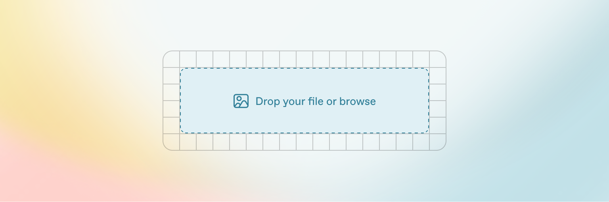

# Warna

### Warna Utama

<table data-view="cards"><thead><tr><th></th><th></th><th></th><th data-hidden data-card-cover data-type="image">Cover image</th></tr></thead><tbody><tr><td><strong>Primary</strong></td><td><kbd>#12345</kbd></td><td>R:878 G:767 B878</td><td><a href=".gitbook/assets/Screenshot 2025-08-30 at 17.25.14.png">Screenshot 2025-08-30 at 17.25.14.png</a></td></tr><tr><td>Secondary</td><td>#123</td><td>R:878 G:767 B878</td><td><a href=".gitbook/assets/Screenshot 2025-08-30 at 17.25.14.png">Screenshot 2025-08-30 at 17.25.14.png</a></td></tr><tr><td>Accent</td><td>#231421</td><td>R:878 G:767 B878</td><td><a href=".gitbook/assets/https___gitbookio.github.io_onboarding-template-images_images-hero.webp">https___gitbookio.github.io_onboarding-template-images_images-hero.webp</a></td></tr></tbody></table>


| <p><br><strong>Base</strong></p><p><br><code>#213213</code><br></p><p>R:878 G:767 B878</p> | <p><br><strong>Succecs</strong></p><p><br><code>#321332</code></p><p>R:878 G:767 B878</p> | <p><br><strong>Succecs</strong></p><p><br><code>#412522</code><br>RGB21312321</p> | <p><br><strong>Succecs</strong></p><p><br><code>#323212</code></p><p>R:878 G:767 B878</p> |
| --------------------------------------------------------------------------------------------------------------------------------------------------------------------------------------- | ----------------------------------------------------------------------------------------------------------------------------------------------------------------- | --------------------------------------------------------------------------------------------------------------------------------------------------------- | ----------------------------------------------------------------------------------------------------------------------------------------------------------------- |

#### Gradient&#x20;

|                                                                                     |   |   |
| ----------------------------------------------------------------------------------- | - | - |
| <p><br></p> |   |   |

#### Warna Produk

| Warna                                                                                                                                                                                                                                                              | css             | code                                     |
| ------------------------------------------------------------------------------------------------------------------------------------------------------------------------------------------------------------------------------------------------------------------ | --------------- | ---------------------------------------- |
| <p><strong>NEW CAR</strong><br>  <code>#232131</code><br> <kbd>#232131</kbd></p> | -newcar-primary | #321323                                  |
|  new-secondary                                                                                                                                                            | -newcar-sec     | [#gradient](warna.md#gradient "mention") |


{% column width="50%" %}
<figure><figcaption></figcaption></figure>

New Car

  `#323256`&#x20;

 <kbd>#213232</kbd>


```
#123234
R:123 G:213 B:213
C:213 M:213 Y:213 K:12
```


{% column width="50%" %}




